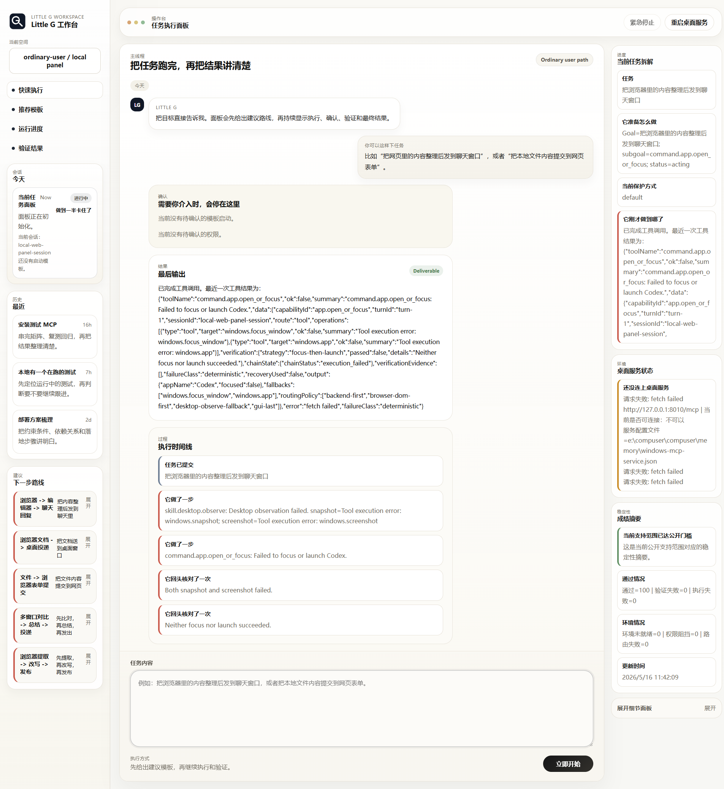

# compuser-littleG

[](./LICENSE)


`compuser-littleG` is a Windows-focused single-agent task-chain runtime for practical desktop workflows.

It combines a query engine, capability-first routing, Windows-MCP desktop control, and a local web panel into one repo, with a strong bias toward:

- backend-first execution before GUI automation
- explicit observe -> act -> verify desktop flows
- replayable regression coverage instead of vague behavior claims
- documented support boundaries instead of marketing-style overreach



## Why This Repo Exists

This project is built around a simple idea: a desktop agent should be useful because its behavior is routable, inspectable, and verifiable, not because it makes the broadest possible claims.

The current implementation stays intentionally grounded:

- single-agent execution instead of a multi-agent runtime
- capability-first routing across CLI, backend, and GUI paths
- local Windows development and endpoint-backed validation
- release and support wording anchored to checked artifacts and docs

## What It Includes

- a query engine and tool runtime under `packages/core` and `packages/tools`
- a capability-first routing layer under `packages/capabilities`
- a Windows-MCP adapter for desktop observation and action under `packages/adapters/windows-mcp`
- a local web panel for task submission under `apps/web-panel`
- regression and smoke runners under `apps/cli`

## Current Scope

This repository is intentionally centered on a Windows local-development workflow.

Current project direction and support language are defined by the documents below:

- architecture authority: [ARCHITECTURE.md](./ARCHITECTURE.md)
- development and verification runbook: [DEVELOPMENT.md](./DEVELOPMENT.md)
- current support boundary: [PHASE5_VERIFIED_SUPPORT_ENVELOPE.md](./PHASE5_VERIFIED_SUPPORT_ENVELOPE.md)
- web-panel boundary: [apps/web-panel/WEB_PANEL_BOUNDARIES.md](./apps/web-panel/WEB_PANEL_BOUNDARIES.md)

The project does not claim a general desktop-agent support surface beyond what is explicitly frozen in those files.

## Product Surface

The current product-facing surface in this repository is a local web panel that can:

- submit local task requests
- route through the same runtime stack used by the CLI path
- surface provider and session-control behavior
- stay aligned with the current documented support envelope

The screenshot above is taken from the repository's current local web-panel work.

## Quick Start

Install dependencies and run the smallest safe checks first:

```powershell
npm install
npm run check
npm run build
```

Useful local entry points:

```powershell
npm run dev
npm run web:panel
npm run test
```

## Verification

The fastest general-purpose validation path is:

```powershell
npm run check
npm run test
```

For additional project-specific verification commands, use [DEVELOPMENT.md](./DEVELOPMENT.md).

## Key Commands

```powershell
npm run dev
npm run web:panel
npm run test
npm run phase4:chains
```

## Demo Flow

Use this 4-step local flow to see the repository in action:

1. Install dependencies and build the project.

```powershell
npm install
npm run build
```

2. Run the fastest safety checks before trying interactive paths.

```powershell
npm run check
npm run test
```

3. Start the local web panel.

```powershell
npm run web:panel
```

4. Open the panel, submit a local task, and inspect the runtime behavior through the same documented boundaries used by the CLI and verification scripts.

For endpoint-backed or Windows-MCP live validation, use the staged commands in [DEVELOPMENT.md](./DEVELOPMENT.md) instead of treating the web panel alone as proof of the full support surface.

## Repository Layout

```text
apps/
  cli/        regression runners, smoke runners, local entry points
  web-panel/  local product-facing panel
packages/
  core/       query engine and model runtime
  capabilities/
  tools/
  security/
  adapters/
fixtures/     provider regression fixtures
tests/        minimal targeted tests
docs/         delivery and operator-facing notes
```

## Notes

- this repository currently uses local documentation as the source of truth for architecture and support claims
- `memory/`, `artifacts/`, `dist/`, `tmp/`, and `node_modules/` are local/generated paths and are not intended as committed source content
